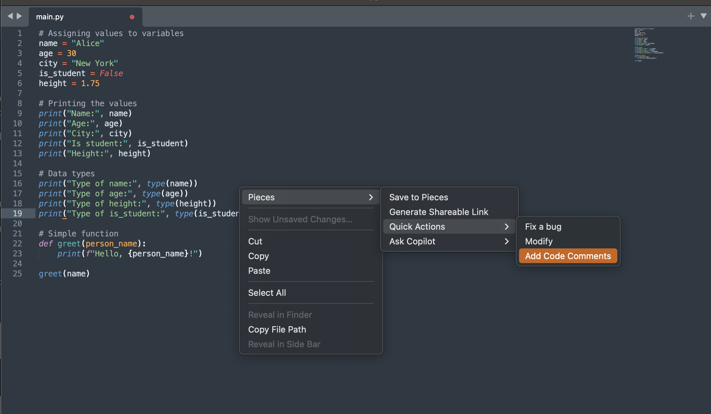

# Pieces for Sublime

See the [full docs](https://docs.pieces.app/products/extensions-plugins/sublime)

Pieces is an all-in-one productivity tool that gives developers complete contextual awareness of their workflow from browsers to Slack and other IDEs, no matter the source.
Leverage the power of the Pieces Copilot, the Long-Term Memory Engine, and Pieces Drive—all directly within Sublime.

## Enhanced AI Assistance

Pieces provides comprehensive AI-driven capabilities, enabling developers to:

- **Query cloud and local LLMs** directly within Sublime
- **Generate context-aware code solutions** and suggestions
- **Access Long-Term Memory** across your workflows and apps
- **Explain and comment code** intelligently to enhance readability
- **Troubleshoot and fix bugs** efficiently with contextual insights

## Configuration

Before diving in, let's ensure everything is set up to your liking. You can customize the LLM model or some other settings by navigating to: `Preferences > Package Settings > Pieces > Settings`.

You can also open the settings from the command palette `Pieces: Open Settings`.

## Pieces Copilot

Initiate a conversation with the LLM of your choice, providing as much context as needed by adding files, folders, or even entire repositories to the chat.

To initiate Copilot from the editor, select a portion of code, right-click, and hover over the Pieces item in the context menu.

## Quick Actions

Pieces can **Comment**, **Modify**, **Fix a bug** or **Explain** your code when you select an action from the right-click context menu in the editor.

## Pieces Drive

Pieces allows you to save materials such as code snippets into your Pieces Drive, and enriches them with AI-generated metadata, such as tags, titles, authorship details, and descriptions, keeping everything organized and accessible. To access your Pieces Drive:

1. Open your command palette (`Ctrl+Shift+P` or `Cmd+Shift+P`).
2. Run the command: `Pieces: Open Saved Material`.
3. Select the asset you wish to open from the list.

## Generate Shareable Links

If you want to [share a saved snippet](https://docs.pieces.app/products/desktop/drive/sharing) with another developer (even if they don't have a Pieces account), you can.

Just select the code, right-click to open the context menu, and choose `Pieces > Generate shareable link`.

You can also share a saved snippet by opening it with `Pieces: Open saved Material` and clicking the **Share** button.

## Connect with Pieces

#### Join our Discord

Become a part of our [Discord community](https://discord.gg/getpieces) to stay updated and engage in discussions about our features.

#### Submit a Feature Request or Feedback

Have an idea for a new feature? Feel free to submit your suggestions on our [GitHub support repo](https://github.com/pieces-app/support).

#### Tech Blogs

Stay connected and up-to-date with our latest [blogs](https://pieces.app/blog).

#### Plugins

Explore our collection of awesome Pieces [plugins](https://pieces.app/plugins).
